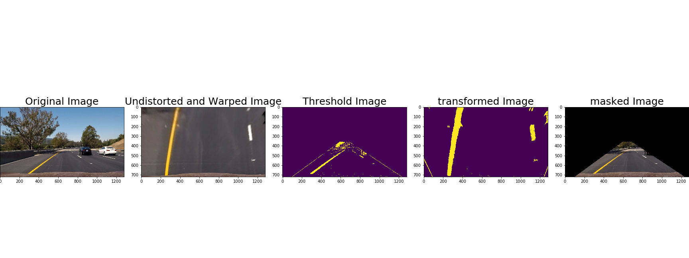

## Writeup Template

---

**Advanced Lane Finding Project**

The goals / steps of this project are the following:

* Compute the camera calibration matrix and distortion coefficients given a set of chessboard images.
* Apply a distortion correction to raw images.
* Use color transforms, gradients, etc., to create a thresholded binary image.
* Apply a perspective transform to rectify binary image ("birds-eye view").
* Detect lane pixels and fit to find the lane boundary.
* Determine the curvature of the lane and vehicle position with respect to center.
* Warp the detected lane boundaries back onto the original image.
* Output visual display of the lane boundaries and numerical estimation of lane curvature and vehicle position.

[//]: # (Image References)

[image1]: ./output_images/Undistorted_chess.png "Undistorted"

[image2]: ./output_images/Undistorted.png "Road Transformed"
[image3]: ./output_images/Threshold.png "Binary Example"
[image4]: ./output_images/Warped.png "Warp Example"
[image5]: ./output_images/slide_window_search_result.png "Fit Visual"
[image6]: ./output_images/fill_result.png "Output"
[video1]: ./result.mp4 "Video"

## [Rubric](https://review.udacity.com/#!/rubrics/571/view) Points

### Here I will consider the rubric points individually and describe how I addressed each point in my implementation.  

---

### Writeup / README

#### 1. Provide a Writeup / README that includes all the rubric points and how you addressed each one.  You can submit your writeup as markdown or pdf.  [Here](https://github.com/udacity/CarND-Advanced-Lane-Lines/blob/master/writeup_template.md) is a template writeup for this project you can use as a guide and a starting point.  

You're reading it!

### Camera Calibration

#### 1. Briefly state how you computed the camera matrix and distortion coefficients. Provide an example of a distortion corrected calibration image.

* First, I converted the given camera_calibration pictures into grayscaled ones, and used the `cv2.findChessboardCorners()` in Opencv to identify their corners.
* Second, the detected corners were set as the image points--imgpoints. Then I set the object points--objpoints based on the actual corners of the images.
* Third, I fed the imgpoints and objpoints to the `cv2.calibrateCamera()` function to get the camera calibration matrix and distortion coefficients.
* Forth, the camera calibration matrix and distortion coefficients were used with the OpenCV function `cv2.undistort()` to remove distortion on test images. Here is an example: 

![alt text][image1]

### Pipeline (single images)

#### 1. Provide an example of a distortion-corrected image.

To demonstrate this step, I will describe how I apply the distortion correction to one of the test images like this one:

I used the camera calibration matrix and distortion coefficients to undistort the highway driving images. 
The contrast with the original image is as follows: 

![alt text][image2]

#### 2. Describe how (and identify where in your code) you used color transforms, gradients or other methods to create a thresholded binary image.  Provide an example of a binary image result.


I converted the image to HLS color spaces and used the S Channel, with a min threshold of 170 and a max threshold of 255. This did a fairly good job of identifying both the white and yellow lane lines. 

Beside, I calculated the x_orientated, y_orientated, magnitude, direction of sobel. With different thresholds, it also did a good job.

Then I used a combination of HLS and sobel thresholds to generate a binary image.  

Here's an example of my output for this step. 

![alt text][image3]

#### 3. Describe how (and identify where in your code) you performed a perspective transform and provide an example of a transformed image.

In order to transform the undistorted image to a "birds eye view" of the road, I investigated a typical picture, manually visualize the locations of the lane lines, and set the source--`src` and destination points--`dst`. Then I applied `cv2.getPerspectiveTransform` and `cv2.warpPerspective` to get the warped image.

![alt text][image4]


This resulted in the following source and destination points:

| Source        | Destination   | 
|:-------------:|:-------------:| 
| 570, 470      | 223,0       | 
| 722, 470     | 893,0      |
| 1027.79,676.525     | 893,720     |
| 279.837,676.525      | 223,720        |

Besides, I also applied the region mask technic on these images, with the help of `cv2.fillPoly`. After I applied all these technics, I got the final results: 



However, I didn't apply the region mask on video frame,. 


#### 4. Describe how (and identify where in your code) you identified lane-line pixels and fit their positions with a polynomial?

I identified peaks in a histogram of the binary image to determine original location of lane lines. Then I detected all non zero pixels around it, to get the coordinates. Afterwards, I fitted a 2nd order  polynomial with the help of the `np.polyfit()` function to get the polynomial coefficient.


![alt text][image5]

#### 5. Describe how (and identify where in your code) you calculated the radius of curvature of the lane and the position of the vehicle with respect to center.

-  I defined conversions from pixels space to meters like this: 

```
ym_per_pix = 30/720 # meters per pixel in y dimension

xm_per_pix = 3.7/700 # meters per pixel in x dimension
```

- I calculated the curvature lane lines of the image bottom. Then I use the mean of two lane curvatures as the result. *source:* http://www.intmath.com/applications-differentiation/8-radius-curvature.php

```
left_real_curverad = ((1 + (2*left_fit[0]*y_eval*ym_per_pix + left_fit[1])**2)**1.5) / np.absolute(2*left_fit[0])

right_real_curverad = ((1 + (2*right_fit[0]*y_eval*ym_per_pix + right_fit[1])**2)**1.5) / np.absolute(2*right_fit[0])

```
- I calculated the mean of left and right bottoms of lane lines as the vehicle position. Then I calculated the distance of between the position and the center of the image as the offset. 

```
left_bottom = left_fit[0]*720**2 + left_fit[1]*720 + left_fit[2]
right_bottom= right_fit[0]*720**2 + right_fit[1]*720 + right_fit[2]

position = (left_bottom+right_bottom)/2.0
offset = (640 - position)*3.7/700
```

#### 6. Provide an example image of your result plotted back down onto the road such that the lane area is identified clearly.

Finally, I defined a function to process the image. 

- Fill and highlight the space between lane lines.
- Use inverse perspective transformation to unwarp the image from birds eye back to its original perspective.
- Print the offset from center and radius of curvature on to the final outputs.

Here is an example of my result on a test image:

![alt text][image6]

---

### Pipeline (video)

#### 1. Provide a link to your final video output.  Your pipeline should perform reasonably well on the entire project video (wobbly lines are ok but no catastrophic failures that would cause the car to drive off the road!).

First, I defined a class `Line()` with `window()` and `around()` methods . 

Second, I detected lane line pixels with `window()` if no lane lines was found in the previous frame, otherwise, I used `around()` for detection close to the polynomial calculated based on previous frame. 

Third, to smooth the output, I chose to average the polynomial coefficients over the past 10 frames. 

Here is the final result:

[video1]
---

### Discussion

#### 1. Briefly discuss any problems / issues you faced in your implementation of this project.  Where will your pipeline likely fail?  What could you do to make it more robust?

When there was shadow over the road, it was easy for fail. When I found the detected lane lines were largely different from previous ones, I would ignore them. 
When the road was exposed on various light, weather, it would be more difficult. I would collect more driving videos to extract the feature of different circumstances and hunt for solutions. 
