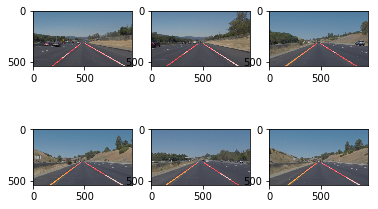

# **Finding Lane Lines on the Road** 

## Writeup Report

---

**Finding Lane Lines on the Road**

The goals / steps of this project are the following:
* Make a pipeline that finds lane lines on the road
* Reflect on your work in a written report

---

### Reflection

### 1. Describe your pipeline. As part of the description, explain how you modified the draw_lines() function.

My pipeline consisted of 6 steps. 

First, I converted the images to grayscale, then I used gaussian_blur function to finish the pretreatment. 
Second, I detected edges of the images through Canny function.

Third, I selected the interested region of the images through a self defined function, and filled pixels of other regions with zeros.

Forth, I detected lane line segments in the region of interest. By tuning parameters like rho, theta, threshold, min_line_len, max_line_gap, I could get enough accuracy.

Fifth, in order to draw a single line on the left and right lanes, I modified the draw_lanes() function by the following method. I separated the left and right lines by calculating the slope of Hough lines, k = (y2 - y1) / (x2 - x1), calculated the mean of the slopes, deleted points of lines with too much slope bias to the mean. Then I fitted the left points to get the slope, and calculated the ceiling and bottom points. So I got (xmin, ymin), (xmax, ymax), and draw perfect lane lines. 

Sixth, I mixed the lane line images with the initial images with the addWeighted function, and got the final images, like this:

### 2. Identify potential shortcomings with your current pipeline

However, there are some shortcomings in my code.

For one thing, lane lines would be difficult to be detected when the line segments are far away from each other, or line segments are shorter. 

For another, when the size of the images or the lane line region are not the same with the example in the code, many lane lines would not be detected.

### 3. Suggest possible improvements to your pipeline

Thus, there are some possible improvements to modify the code.

One the one hand, adjust the Houghline parameters, like minLineLength, maxLineGap, depending on the size of lane lines.

One the one hand, use the percentage of image size to define points of the region mask function instead of particular numbers.
